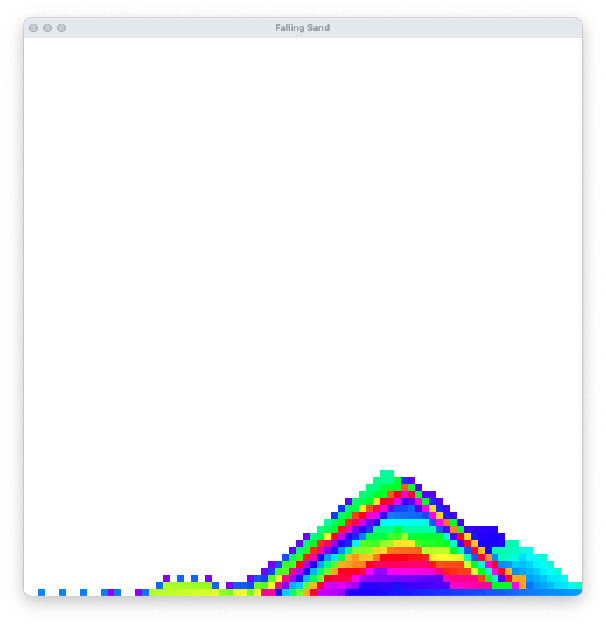

# Falling Sands

This project is inspired by [The Coding Train](https://www.youtube.com/@TheCodingTrain) and specifically the video ["Coding Challenge 180: Falling Sand"](https://www.youtube.com/watch?v=L4u7Zy_b868).

## Overview

The Falling Sands project simulates particles of sand falling, interacting with each other and the environment. This implementation is written in Java.

## Getting Started

1. Clone the repository.

2. Open the project in your preferred Java development environment (e.g., IntelliJ IDEA, Eclipse).

3. Build the project using your preferred build tool (e.g., Maven, Gradle).

4. Run the `App` class to start the simulation.

## Functions

- Move the Mouse across the window to let the Sand fall

- Press Enter to Reset your Canvas

## Acknowledgements

Special thanks to [The Coding Train](https://www.youtube.com/@TheCodingTrain) for the inspiration and educational content.
