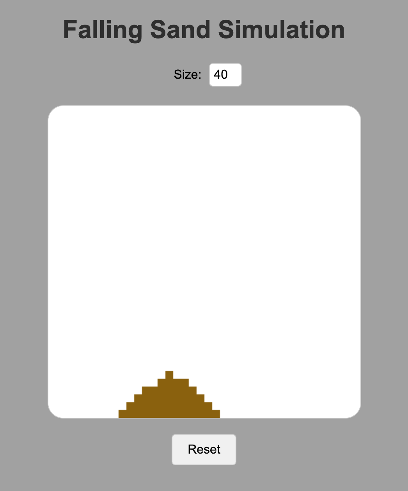

# Falling Sands

This project is inspired by [The Coding Train](https://www.youtube.com/@TheCodingTrain) and specifically the video ["Coding Challenge 180: Falling Sand"](https://www.youtube.com/watch?v=L4u7Zy_b868).

## Overview

The Falling Sands project simulates particles of sand falling, interacting with each other and the environment.

## Getting Started

1. Clone the repository.
2. Open the project in your preferred development environment.
3. Run the simulation and enjoy!

## Acknowledgements

Special thanks to [The Coding Train](https://www.youtube.com/@TheCodingTrain) for the inspiration and educational content.
